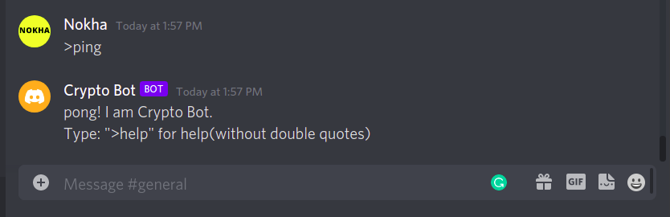
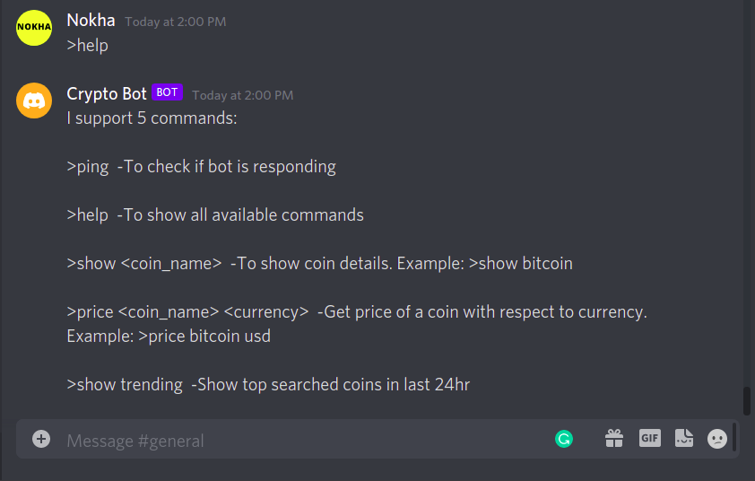
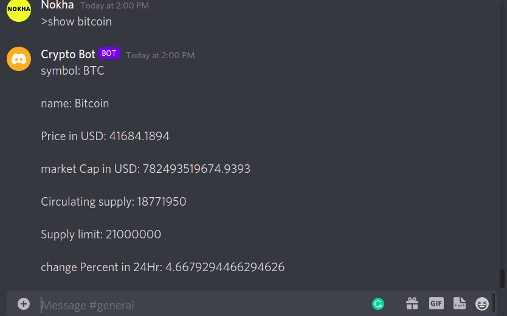
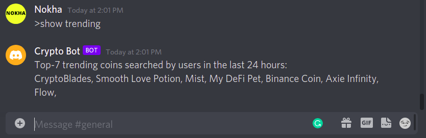
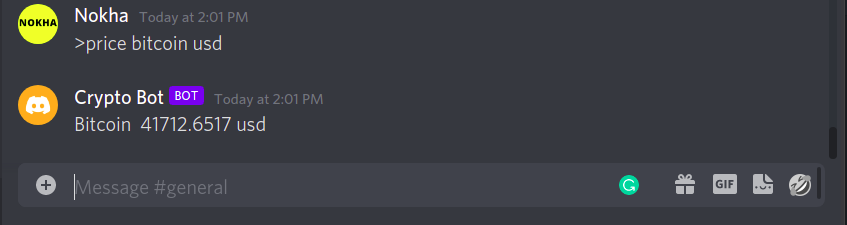

# CryptoBot 
This is a Discord chat bot which can help you to get the latest crypto coins details, prices and show trending coins. It uses public API to fetch data.

# APIs 
1. [Currency-api](https://github.com/fawazahmed0/currency-api) - Free Currency Exchange Rates API with 150+ Currencies & No Rate Limits
2. [CoinCap](https://docs.coincap.io/) - Real time Cryptocurrency prices through a RESTful API
3. [CoinGecko](https://www.coingecko.com/en/api) - Cryptocurrency Price, Market, and Developer/Social Data

# CryptoBot commands 
1. \>ping -To check if bot is responding
2. \>help  -To show all available commands
3. \>price <coin_name> <currency>  -Get price of a coin with respect to currency. Example: \>price bitcoin usd
4. \>show <coin_name>  -To show brief coin details. Example: >show bitcoin
5. \>show trending  -Show top searched coins in last 24hr

# NPM Dependencies
discord.js,

dotenv,

node-fetch

# Installation
npm install

# Examples

